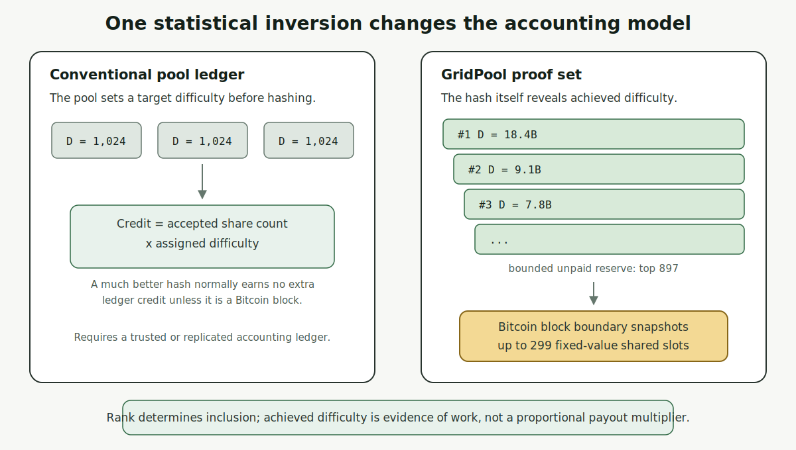
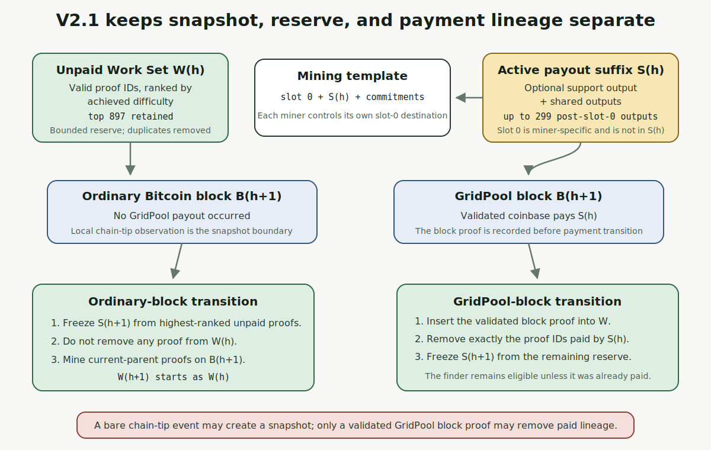
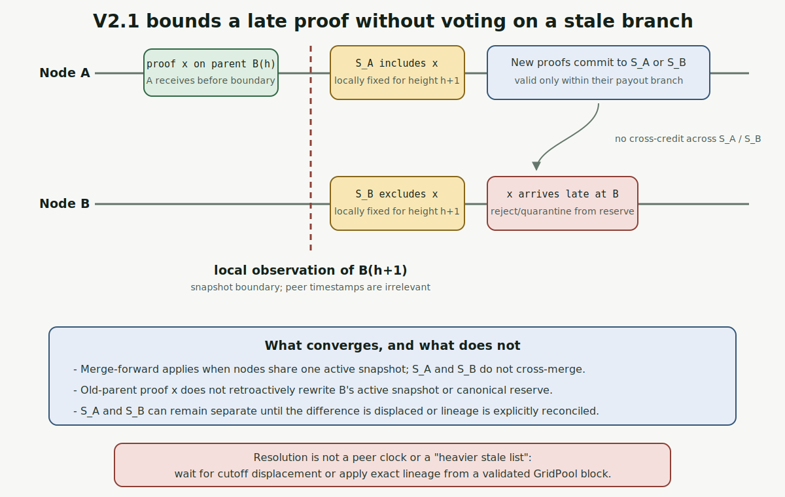
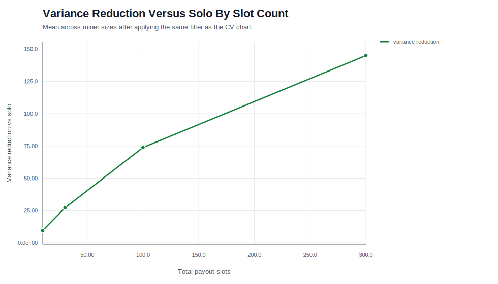
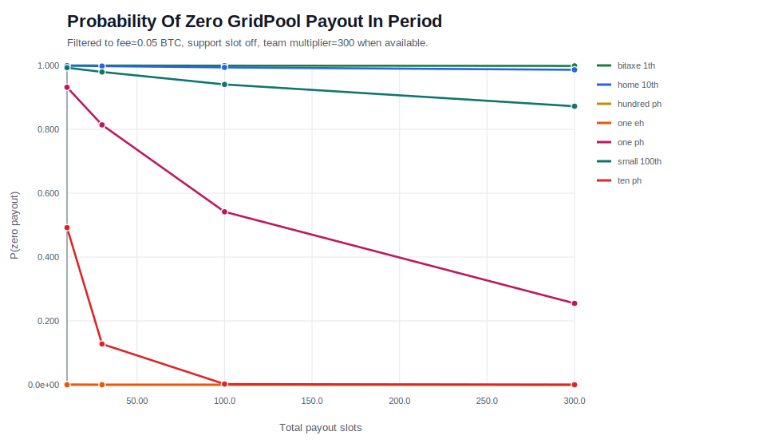
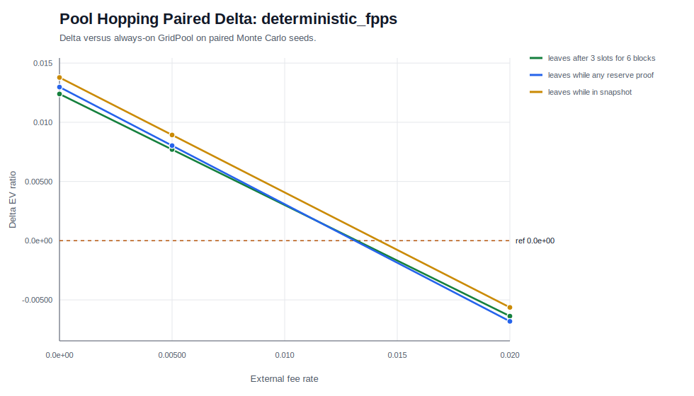
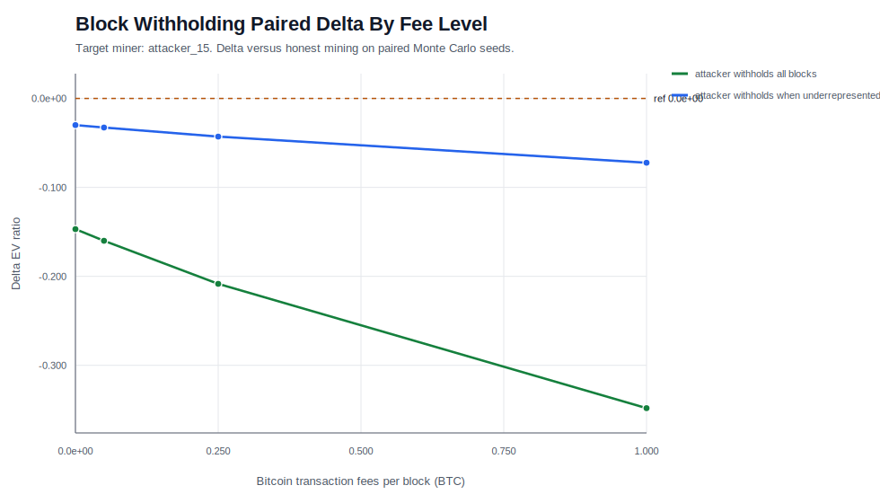

# Executive Summary

GridPool is an experimental Bitcoin reward-sharing protocol. Miners construct
their own block templates, retain the block-finder output and transaction fees,
and commit a common payout suffix directly in the coinbase. There is no pool
wallet, later payout promise, or separate sharechain.

The core innovation is **ranked achieved difficulty**. Conventional pool ledgers
normally count shares at an assigned target difficulty. GridPool instead keeps
a bounded set of the best actual proof-of-work outcomes. The cutoff of a
fixed-depth list is an order statistic that estimates the accumulated work that
produced it. This allows sparse, independently verifiable accounting without
retaining every low-difficulty share.

V2.1 separates:

- an Unpaid Work Set of up to `897` validated proofs;
- an Active Snapshot containing the fixed post-slot-0 payout suffix; and
- Paid Lineage identifying exactly which proof IDs a GridPool block consumed.

Every Bitcoin block snapshots the best unpaid work without clearing it. A real
GridPool block pays the active snapshot and removes only the proof IDs actually
paid. Under the intended V2.1 rule, compatible proofs on the current Bitcoin
parent merge forward only within the same active payout state, while unknown
previous-parent proofs arriving after a node's local boundary cannot rewrite
it. Candidate-state IDs are anchored to the active snapshot. A new runtime
regression confirms that a proof carried by a genuinely different active payout
snapshot cannot be imported into the local candidate state.

The evidence is promising but bounded:

- modeled 300-slot payouts substantially reduce actual BTC variance in mature
  team scenarios;
- proof claims cannot be forged through pool hopping or Sybil identities;
- straightforward profit-seeking block withholding is costly in the current
  model;
- compact relay sharply reduces immediate boundary disagreement in a stylized
  24-node model; and
- a deliberately permissive selective-inclusion model found a large
  free-riding transfer if proofs from genuinely different active payout states
  were cross-credited, while the runtime regression showed that the reference
  implementation rejects that transition; and
- preliminary public-node telemetry confirms that UDP, WebSocket, and HTTP
  arrivals are observable and that UDP is often first.

This paper does not claim solved Byzantine consensus. The implementation
audit identified direct-ingress stale-parent admission, cross-snapshot paid
lineage, fee-variant lineage, and recovery from a genuine active-snapshot split
as cases that need explicit fixes, policy, or tests before V2.1 should be
considered consensus-complete.

# The Ranked-Proof Idea

**Why this matters:** ordinary pools account for work by counting enormous
numbers of low-difficulty shares in a private ledger. GridPool can retain only
the best `897` unpaid proofs. The difficulty of the weakest retained proof is a
compact statistical measurement of how much hashing produced the full set,
while the ranking itself determines which proofs remain eligible for payment.
This inversion is what makes bounded, independently verifiable accounting
possible without a sharechain or trusted share counter.



For an admission difficulty `d_min`, a qualifying hash's achieved difficulty
`D` satisfies

$$
\Pr[D \ge x \mid D \ge d_{\min}] = \frac{d_{\min}}{x}.
$$

Therefore `V=d_min/D` is approximately uniform on `(0,1)`. If `S` qualifying
hashes were generated and `D_(m)` is the `m`-th best achieved difficulty, then

$$
\widehat{S} \approx m\frac{D_{(m)}}{d_{\min}}.
$$

An unbiased fixed-`S` form is `(m-1)/V_(m)`, with relative standard error
approaching `1/sqrt(m-2)`. That is approximately:

| Retained rank | Approximate relative standard error |
| ---: | ---: |
| `300` | `5.79%` |
| `897` | `3.34%` |

The distribution is heavy-tailed, so summing achieved difficulties is dominated
by rare outliers. The fixed-rank cutoff is therefore useful for estimating the
work represented by a full reserve and diagnosing network views. V2.1 does
**not** use that estimate to choose a winner between divergent active payout
snapshots; compatible evidence merges only within the same active state.

This is a ranking mechanism, not proportional pay-per-difficulty. A selected
proof earns one fixed shared slot. Higher achieved difficulty improves its rank
and survival probability.

# V2.1 State and Payout Construction

The results below depend on three state objects. This section provides only the
minimum protocol context needed to interpret the models; detailed construction
and validation rules belong in the companion whitepaper and specification.

| Object | Meaning |
| --- | --- |
| Unpaid Work Set | Top `897` distinct, validated, unpaid proof IDs, sorted by achieved difficulty. |
| Active Snapshot | Common post-slot-0 payout suffix frozen at a Bitcoin block boundary. |
| Snapshot Context | Payout suffix against which a proof's coinbase was mined. |
| Paid Lineage | Exact proof IDs consumed by an accepted GridPool block. |

The default coinbase has `300` conceptual positions: miner-specific slot 0 plus
up to `299` post-slot-0 positions. Each position receives one equal subsidy
slice; slot 0 also receives transaction fees, integer remainder, and any
unfilled bootstrap value. An optional canonical support output occupies one of
the post-slot-0 positions when enabled.




## Ordinary Bitcoin block

1. Freeze the next Active Snapshot from the top unpaid proofs.
2. Preserve the entire Work Set because no GridPool payout occurred.
3. Move mining to the new Bitcoin parent.

## GridPool block

1. Validate and insert the block proof into the Work Set.
2. Identify the snapshot actually paid by the block's coinbase.
3. Remove exactly those paid proof IDs once.
4. Build the next Active Snapshot from the remaining reserve.

The finder therefore earns slot 0 and fees immediately and normally remains
eligible for a future shared position. A chain-tip notification can create an
ordinary snapshot, but it must not remove lineage without a validated GridPool
block proof.

# Boundary Races and Merge-Forward Recovery

Two honest nodes can see a strong share and a new Bitcoin block in opposite
orders. They may briefly build different payout snapshots even though neither
is cheating. V2.1 treats ordinary differences in new, compatible work as a set
synchronization problem, while refusing to let proofs disclosed only after a
node's boundary rewrite that node's past.

If two peers share the same active payout state but have different valid proofs
on the **current** Bitcoin parent, the correct operation is union,
deduplication, deterministic sort, and trim to `897`. It is not a vote between
whole candidate lists.

That rule does not authorize cross-credit between genuinely different active
payout snapshots. Candidate-state IDs commit to the active state as well as the
candidate Work Set. A bundle built on active snapshot `S_B` therefore does not
recompute to the same candidate ID under a node whose active snapshot is
`S_A`. The tested import path rejects it rather than silently crediting the
proof on both branches.

Nodes cannot trust peer clocks. Under the V2.1 rule, once a node locally observes
the next Bitcoin block, an unknown proof on the previous parent cannot be used
to rewrite its Active Snapshot or canonical future reserve. This prevents an
attacker from backdating intentionally stale work and invoking a deterministic
"heavier stale list wins" rule.

The candidate-bundle import path has a robust boundary safety gate. The current
hardening task is to unify direct share ingress with that same rule: old parents
may be retained to verify known lineage, but newly disclosed old-parent proofs
must not enter canonical live state.



A proof seen by A before the boundary but by B after it can create `S_A != S_B`.
B rejects or quarantines that old-parent proof. New proofs on the current parent
can merge when their retained context belongs to the same active payout state.
A genuinely different active payout state remains a separate branch unless an
explicit, independently validated recovery rule is added.

This is narrower than a sharechain fork, but it is not guaranteed one-block
convergence. If the missed proof remains payout-cutoff-relevant, the active
suffixes can remain different until:

- the proof is displaced from the relevant cutoff; or
- a valid GridPool block identifies the paid snapshot and every node applies
  exactly that snapshot's lineage.

That second path is consensus-critical. Explicit unit tests are being added for
edge-case reconciliation across different valid snapshots during extreme
network splits. Automatic recovery from a genuine active-snapshot split also
remains an open policy problem; the current runtime correctly avoids solving it
by cross-crediting arbitrary divergent work.

# Findings

## Actual BTC payout variance

The variance study models **actual BTC paid**, not merely probability of holding
a slot. The standard scenario covers `30 days`, `4,320` expected Bitcoin blocks,
a `600 EH/s` reference network, `3.125 BTC` subsidy, and `0.05 BTC` fees.

**The mature-team scale result is particularly important.** Once the team is
large enough to keep the ranked list competitively occupied, a fixed miner's
expected payout-event cadence and asymptotic variance become approximately
independent of total GridPool team hashrate. Doubling the team approximately
doubles GridPool's block frequency while halving that miner's expected positions
per GridPool block; the two effects cancel. Expected BTC remains determined by
the miner's fraction of the Bitcoin network, and variance is governed mainly by
the number of payout positions. This approximation does not apply during a
sparse bootstrap phase or when list occupancy is low.



The mature-team asymptote for `300` total positions is about `271.7x` variance
reduction versus solo in this model, not exactly `300x`. The same variance-
reduction curve applies across miner sizes when team size is expressed as a
multiple of miner hashrate. Absolute payout cadence still depends on the miner's
share of Bitcoin network hashrate; team block cadence and inclusion probability
offset one another in the mature regime.



The zero-payout chart uses the same **30-day** observation period and network
assumptions as the variance study.

The important limitation is bootstrap scale. A broad payout list cannot create
blocks. If the team is too small to find blocks at a useful cadence, a tiny miner
remains lottery-like even when expected value is fair.

## Pool hopping



An earned GridPool proof is a claim backed by real work. Leaving cannot forge a
claim, alter slot-0 attribution, or erase another miner's lineage. The departing
miner gives up future shared-proof chances, slot 0, fees, and acceleration of its
existing claims.

The models do show a limited free-option effect when the outside alternative is
idealized as zero-fee and deterministic or when a large miner can tolerate solo
variance. The measured strategy effects are small and condition-dependent. The
defensible conclusion is:

> Hopping may change how a miner allocates new work, but it cannot create fake
> past work or debit honest miners' proof claims.

## Block withholding



Withholding a valid GridPool block sacrifices slot 0, transaction fees, and
faster payment of the attacker's own shared claims. Straightforward
profit-maximizing withholding underperforms honest mining in the modeled cases.
The modeled attacker controls `15%` of team hashrate. At `0.05 BTC` transaction
fees, withholding every block it finds reduces honest miners' expected reward
by about `14.0%` to `14.2%` relative to the paired honest run, while the attacker
loses about `16.0%`. Withholding only when underrepresented reduces honest
miners by about `3.0%` and the attacker by about `3.3%`.

The harm is economically real but bounded by blocks the attacker actually
finds and suppresses. As a first-order approximation, an attacker with team
hash fraction `a` that withholds fraction `w` of its discoveries removes about
`a x w` of the team's block opportunities; it cannot destroy blocks found by
honest miners. Fewer paid blocks also increase honest miners' waiting-time
variance. The present sweep measures reward impact rather than a clean
variance ratio, so that variance statement is directional, not a calibrated
result. An externally funded griefer can therefore spend money to reduce pool
throughput, but the attack does not amplify beyond the attacker's own share of
suppressed discoveries in this model.

## Selective inclusion and active-state anchoring

A new stress test asked whether a miner could exclude everyone else's proofs
from its own payout snapshot while still relaying its current-parent proofs to
an inclusive team. The model deliberately allowed those proofs to be credited
across genuinely different active payout states. Each row below summarizes `20`
replications of `3,000` Bitcoin blocks at `3%` GridPool network share.

| Attacker hash share | Modeled reward share under cross-state credit | Excess reward share | 95% interval for excess |
| ---: | ---: | ---: | ---: |
| `10%` | `16.775%` | `+6.775 pp` | `+5.403` to `+8.147 pp` |
| `35%` | `47.921%` | `+12.921 pp` | `+11.906` to `+13.936 pp` |
| `51%` | `64.518%` | `+13.518 pp` | `+12.447` to `+14.590 pp` |
| `67%` | `77.989%` | `+10.989 pp` | `+9.860` to `+12.118 pp` |
| `90%` | `94.357%` | `+4.357 pp` | `+3.779` to `+4.935 pp` |

The equal and opposite honest-miner loss, together with payout-conservation
error below `6.25e-13 BTC`, shows a transfer rather than value creation. The
effect is therefore a strong warning: **a future recovery rule must not blindly
credit proofs across different active payout states.**

This is a counterfactual result, not a confirmed runtime exploit. A regression
constructed two genuinely different active payout snapshots, built a valid
current-parent proof on the exclusionary one, and attempted candidate-bundle
import into the inclusive node. Import was rejected and the inclusive Work Set
remained unchanged. Candidate IDs are anchored to the active state, so the
permissive transition assumed by the stress model is not reachable through the
tested V2.1 candidate-import path. Private-split and canonical-context-only
controls remained near fair expected value within simulation noise.

The resulting engineering conclusion is narrower and stronger than either
model alone: same-active-state evidence should merge, different-active-state
evidence must not be cross-credited by default, and genuine split recovery needs
an explicit lineage-preserving rule rather than a generic "heavier state wins"
or "merge everything current-parent" shortcut.

## Immediate boundary disagreement by relay profile

The V2.1 boundary model uses `24` nodes, target degree `8`, `299` shared slots,
an `897`-proof reserve, `220` relay-worthy shares per Bitcoin interval, and
`60,000` simulated boundaries per relay profile (`5,000 x 12`).

| Relay profile | Boundaries with more than one snapshot | Mean missing shared positions per node | Shared position/node loss |
| --- | ---: | ---: | ---: |
| JSON HTTP | `61.0283%` | `0.2375` | `0.079442%` |
| Compact WebSocket | `11.6200%` | `0.0138` | `0.004606%` |
| UDP fast path with fallback | `0.0550%` | `<0.0001` | `0.000009%` |

**Takeaway:** in this stylized model, moving from JSON/HTTP to compact UDP with
fallback reduces boundaries with disagreement by about `99.91%` and modeled
shared-position loss per node by about `99.99%`.

The high raw split rate for JSON should be read alongside the much smaller
position-loss rate: many modeled splits differ by only one position at one or a
few nodes.

The model's payload totals are aggregate modeled delivery bytes across all 24
nodes and the full `60,000`-boundary run, not bytes per node or per snapshot:

| Relay profile | Full-run modeled payload | Equivalent modeled payload/day across all 24 destinations |
| --- | ---: | ---: |
| JSON HTTP | `4,536.68 MB` | about `10.89 MB/day` |
| Compact WebSocket | `1,852.55 MB` | about `4.45 MB/day` |
| UDP with fallback | `1,850.82 MB` | about `4.44 MB/day` |

The daily conversion uses `60,000 x 600 seconds = 416.7 days` of simulated
Bitcoin time. It is a payload approximation, not measured Internet billing and
not edge-hop-complete network traffic.

Most importantly, this model measures **boundary inclusion**, not how long a
cutoff-relevant disagreement persists. Its original "recovery" name is broader
than the behavior actually simulated.

# Live Network Appendix

> **Field sanity check, not statistical proof.**

A final `24-hour` API query completed at `2026-07-17T16:00:17Z`. Main,
Dallas, Detroit, and Evomining were all reachable, advertised UDP relay version
5, reported four peers, and agreed on both current and candidate state IDs.
The three primary nodes were independently hosted in the Washington, D.C.,
Dallas, and Detroit regions; Evomining was an external operator sanity check.

| Node | Role | Version | Peers | Current state | Candidate state | UDP observations present |
| --- | --- | --- | ---: | --- | --- | ---: |
| Main | Primary | `1.0.0+7b39cf` | `4` | `5b7661b0...` | `8fc36e21...` | yes |
| Dallas | Primary | `1.0.0` | `4` | `5b7661b0...` | `8fc36e21...` | yes |
| Detroit | Primary | `1.0.0` | `4` | `5b7661b0...` | `8fc36e21...` | yes |
| Evomining | External | `1.0.0` | `4` | `5b7661b0...` | `8fc36e21...` | yes |

The APIs recorded `121-156` payout-snapshot events per node during the window,
but no GridPool block, paid-snapshot transition, state import, or state
rejection. This is therefore evidence of steady-state agreement and relay
health, not a live exercise of paid-once lineage or genuine split recovery.
Detroit also advertised one duplicate Dallas peer entry, a minor discovery
hygiene issue that did not prevent state agreement.

The dominant proof-relay categories in that bounded query were:

| Receiver | Class | UDP arrivals / first | WebSocket arrivals / first | HTTP arrivals / first | UDP avg payload | WebSocket avg payload |
| --- | --- | ---: | ---: | ---: | ---: | ---: |
| Main | Pulse | `681/596` | `684/87` | `696/15` | `899 B` | `4,418 B` |
| Dallas | Pulse | `1381/1296` | `1381/166` | `1457/41` | `893 B` | `4,436 B` |
| Detroit | Work | `1386/900` | `1387/633` | `1405/96` | `893 B` | `4,436 B` |
| Evomining | Pulse | `687/616` | `688/68` | `690/10` | `887 B` | `4,452 B` |

**Takeaway:** compact UDP payloads averaged about one fifth of the WebSocket
representation. UDP supplied `3,408` of `4,524` first copies
(`75.3%`) in these dominant categories.
Counts are receiver-local observations, not controlled paired trials; topology,
duplicates, proof class, and missing copies differ.

## Preliminary chain-tip awareness

A clean Main-origin comparison covered `133` unique Bitcoin blocks at Dallas
and `132` at Detroit. Those nodes had no local Bitcoin node, so their
independent baseline was the Mempool.Space WebSocket. GridPool peer relay
arrived before that baseline in `263/265` receiver/block comparisons:

| Receiver | Comparisons | GridPool first | Baseline first | Median peer lead | P95 peer lead |
| --- | ---: | ---: | ---: | ---: | ---: |
| Detroit | `132` | `131` | `1` | `4.29 s` | `8.31 s` |
| Dallas | `133` | `132` | `1` | `2.85 s` | `4.60 s` |
| Combined | `265` | `263` | `2` | `3.47 s` | `7.21 s` |

Across `396` Main-origin header transport races at Detroit, Dallas, and
Evomining, UDP arrived first `252` times, the authenticated persistent session
was effectively tied within `1 ms` `135` times, and the session arrived first
`9` times. The median UDP lead was `4 ms`; p95 was `18 ms`. The
several-second result above is
therefore mainly peer notification versus a public WebSocket baseline, not UDP
versus the persistent GridPool session.

Evomining's local Bitcoin ZMQ comparison still exhibited an intermittent
delayed mode: `36` of `132` source blocks fell outside a conservative
`+/-30 second` healthy window, often in near-ten-minute clusters. Those
samples and Evomining-origin headers were excluded from the chain-tip aggregate.
This is both a data-quality limitation
and an observability finding: peer telemetry detected a local notification-path
problem that ordinary endpoint monitoring could miss.

These measurements show that the public network exposes state and transport
health, that compact relay operates across multiple regions, and that peer
headers can provide useful early awareness. They do not establish Internet-
scale latency, full-block propagation performance, or the safety of mining or
changing consensus state from an unvalidated peer header. The complete
machine-readable query is under `reports/july17/live-telemetry/`.

# Security Claims and Limits

| Topic | What V2.1 provides | What it does not provide |
| --- | --- | --- |
| Sybil identities | Addresses and nodes create no proof-of-work claims. | Connection and eclipse resistance without network controls. |
| Share forgery | Header, coinbase, Merkle path, parent, snapshot, and slot 0 are independently verified. | Protection from every parser or resource-exhaustion bug. |
| Pool hopping | Past claims remain proof-bound and paid once. | A promise that every outside-market condition makes leaving irrational. |
| Block withholding | Finder sacrifices slot 0, fees, and claim acceleration. | Protection from externally motivated griefing. |
| Stale rewrite | Unknown old-parent proofs cannot rewrite a local boundary. | Perfect agreement among nodes that observed events in different orders. |
| Selective inclusion | Candidate IDs bind candidate work to the active payout state; cross-state import is rejected in the tested path. | Automatic reconciliation of genuinely different active snapshots. |
| Transaction censorship | Pool relay does not carry the full transaction list; miners build templates locally. | Cryptographic anonymity or invisibility once a block is public. |
| Majority/sharechain attack | There is no secondary sharechain or generic longest/heaviest-sharechain fork choice to capture. Candidate IDs bind work to an active state, and tested cross-state imports reject. | Proof against every majority censorship, network partition, or griefing strategy. |

# Regression and Implementation Audit

The full reference suite passed on `2026-07-14`; the source currently contains
`102` test methods.

| Invariant | Why it matters | Test status | Source / next step |
| --- | --- | --- | --- |
| Ordinary snapshots preserve unpaid reserve | Bitcoin blocks must not erase unpaid work. | Covered | `ShareAttributionTests.cs:1085` |
| Compatible current-parent work merges within one active state | Honest peers should union evidence, not elect whole lists. | Covered | current-parent candidate-import merge regression in `ShareAttributionTests.cs` |
| Different active payout states cannot cross-credit candidate proofs | Prevents exclusionary branches from free-riding on an inclusive team. | Covered for candidate import | cross-active-snapshot rejection regression in `ShareAttributionTests.cs` |
| Unknown old-parent work cannot cross local boundary | Blocks backdated stale-branch replacement. | **Candidate import covered; direct ingress not enforced** | import test at `:974`; add ingress race tests |
| Retained contexts validate old unpaid proofs | Snapshot churn must not invalidate honest reserve work. | Covered | context tests at `:1361-1477` |
| Local active payment removes only paid IDs | Preserves reserve and enables lucky-streak depth. | Covered in ordinary local path | payment tests at `:1139-1209` |
| Duplicate block does not pay twice | Paid-once transition must be idempotent. | Covered | duplicate test at `:832` |
| Support fee on/off constructs valid suffixes | Optional canonical support must not alter slot count. | Partially covered | construction covered; cross-variant payment lineage missing |
| State bundle cannot smuggle stale proofs | Recovery must not bypass boundary finality. | Partially covered | stale-parent import test exists; add adversarial bundle matrix |
| Block paying retained divergent snapshot removes its actual IDs | Required to reconcile a real block across a latency split. | **Missing; likely implementation gap** | pass paid snapshot ID through payment transition and test both receivers |
| Fee-free block removes all fee-free paid proof IDs | Prevents one paid proof remaining eligible on fee-enabled peer. | **Missing; likely lineage gap** | retain proof IDs per payout variant and add cross-config test |
| Recovery fetches lower-total unique current proof | Merge semantics should not depend on aggregate score. | **Missing** | make recovery set-difference-aware rather than total-difficulty-gated |
| Genuine active-snapshot split recovery | Honest boundary races need a bounded way to heal without enabling cross-state free riding. | **Policy and tests missing** | specify lineage/overlap constraints; do not use unconditional cross-state merge |

# What The Evidence Supports

As of July 17th 2026, the GridPool project can defensibly say:

- GridPool's statistical primitive is a well-defined order statistic, not a
  heuristic share score.
- Fixed-value broad snapshots can reduce actual BTC payout variance while
  preserving expected attribution.
- V2.1's merge-forward design removes routine whole-list "heaviest branch"
  selection for compatible current-parent work within the same active state.
- Candidate-state anchoring blocks the tested cross-active-state selective-
  inclusion path. The simulation shows why weakening that boundary would be
  dangerous, not that the current runtime is exploitable through it.
- GridPool has no sharechain whose tip can be captured by a generic 51%
  sharechain-reorganization strategy. No profitable generic "51% hash wins the
  payout state" attack is currently known under the intended V2.1 rules; tested
  majority selective-inclusion cases could not cross the active-state boundary.
  This is evidence about known mechanisms, not a proof against every majority
  censorship, partition, denial-of-service, or externally funded griefing
  strategy.
- Local non-retroactive boundaries can close the simple backdated stale-work
  entry path without trusting peer clocks once all ingress paths enforce them.
- Fast relay materially reduces immediate boundary disagreement in the model,
  and live telemetry confirms that the transports are measurable.
- The reference implementation has substantial regression coverage and a small,
  explicit list of consensus-critical gaps.

It cannot yet say:

- all nodes always converge at the next Bitcoin block;
- every possible majority-miner, partition, or censorship strategy has been
  excluded;
- UDP has been proven globally superior from a two-operator sample;
- all miner firmware supports a 300-address coinbase; or
- the current implementation is a finished interoperability specification.

# Immediate Engineering Priorities

1. Enforce the local boundary on direct share ingress. Permit old parents for
   validation of already-known lineage, not admission of a newly received proof.
2. Bind GridPool payment removal to the snapshot proven by the winning block,
   not merely the receiver's current active snapshot.
3. Store paid proof lineage separately for support-on and support-off variants,
   or remove cross-variant consensus until it can be unambiguous.
4. Add direct-ingress, cross-snapshot, and cross-config payment tests.
5. Model disagreement persistence through cutoff displacement and actual
   GridPool payment, extending the immediate-boundary model.
6. Continue multi-node UDP/pulse telemetry with explicit run windows, restarts,
   topology, and paired-proof counts.
7. Publish a normative V2.1 specification and implementation-independent test
   vectors.
8. Specify bounded recovery for genuine active-snapshot splits without allowing
   unconditional cross-state proof credit. Treat the selective-inclusion model
   as a regression oracle for proposed recovery rules.

# Reproducibility

## Test suite

```bash
cd /home/keegreil/Documents/GitHub/boot-protocol
dotnet test boot.tests/boot.tests.csproj --no-restore --verbosity minimal
```

## V2.1 immediate-boundary model

```bash
cd /home/keegreil/Documents/GitHub/gridpool-simulations
python3 run_v21_latency_recovery.py \
  --out-dir reports/generated/v21_latency_recovery_july17_long \
  --blocks 5000 \
  --replications 12 \
  --node-count 24 \
  --peer-degree 8 \
  --shared-slots 299 \
  --reserve-multiplier 3 \
  --shares-per-block 220
```

## Selective-inclusion counterfactual

```bash
cd /home/keegreil/Documents/GitHub/gridpool-simulations
python3 run_v21_selective_inclusion.py \
  --out-dir reports/generated/v21_selective_inclusion_long \
  --blocks 3000 \
  --replications 20
```

The permissive `merge_all_current_parent` policy is intentionally broader than
the tested runtime. Compare it with `canonical_context_only`, then run the
`CandidateImportRejectsCurrentParentProofFromDifferentActiveSnapshotAsync`
regression in `boot-protocol` to check reachability.

## Live relay query

```bash
cd /home/keegreil/Documents/GitHub/boot-protocol
node scripts/peer-relay-latency-report.mjs \
  --url https://main.gridpool.net \
  --window 12h \
  --limit 5000
```

## Generated evidence

| Topic | Path |
| --- | --- |
| Payout variance | `reports/generated/sweeps/payout_variance_fee_long/` |
| Pool hopping | `reports/generated/sweeps/pool_hopping_external_mode_299_long/` |
| Block withholding | `reports/generated/sweeps/block_withholding_fee_sensitivity_long/` |
| V2.1 boundary inclusion | `reports/generated/v21_latency_recovery_july17_long/` |
| Selective-inclusion counterfactual | `reports/generated/v21_selective_inclusion_long/` |
| Live telemetry | `reports/july17/live-telemetry/` |

# Companion Documents

- Draft whitepaper: `gridpool-spec/gridpool-whitepaper-draft.md`
- Reference implementation: `boot-protocol`
- Modeling code and generated evidence: `gridpool-simulations`
- V2.1 implementation audit: `boot-protocol/docs/consensus-selection-audit.md`
- Critic FAQ: `boot-protocol/docs/critic-faq.md`

# References

1. Satoshi Nakamoto, [Bitcoin: A Peer-to-Peer Electronic Cash System](https://bitcoin.org/bitcoin.pdf).
2. Meni Rosenfeld, [Analysis of Bitcoin Pooled Mining Reward Systems](https://arxiv.org/abs/1112.4980).
3. [BIP 22: getblocktemplate - Fundamentals](https://github.com/bitcoin/bips/blob/master/bip-0022.mediawiki).
4. [Stratum V2 Template Distribution Protocol](https://stratumprotocol.org/specification/07-template-distribution-protocol/).
5. GridPool source, tests, scenarios, and generated reports cited above.
